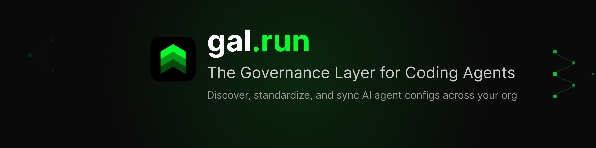

<p align="center">
  
</p>

<p align="center">
  <a href="https://gal.run"></a>
  <a href="https://status.scheduler-systems.com"></a>
  <a href="LICENSE"></a>
</p>

# gal — open-source governance toolkit for AI coding agents (git SDLC hooks + MCP servers today; config-and-policy control plane in active development)

gal is an open-source toolkit building toward a config-and-policy control plane
for AI coding agents. Today it installs git SDLC hooks (tests-before-commit and
issue-reference checks) and ships MCP servers (terminal, vision, browser) for
your agents. Hosted config discovery and sync need an account; cross-agent hook
install and per-tool blocking enforcement are in active development.

**Status:** pre-1.0 — building toward v1.0 enforcement.

Under the hood, gal binds every surface to a small, auditable core: a pure-C
**reference monitor** sits at the head of the repo behind a **frozen ABI**, and
every other surface — Go services, TypeScript SDKs and MCP servers, the Rust CLI,
the dashboard — binds to that one contract. gal is Apache-2.0, open core, and you
build the whole platform **from source today**:

```bash
# build everything from source, in ABI order (kernel header first)
just all          # or `just kernel` / `just services` for one ecosystem
```

> **Self-host via Docker Compose is a work-in-progress.**
> [`deploy/docker-compose.yml`](deploy/docker-compose.yml) is a **skeleton**: the
> per-service images (`ghcr.io/gal-run/<svc>:dev`) are not yet published, and the
> Go services are currently skeleton binaries. To build the images locally,
> uncomment the `build:` block under each service and run:
>
> ```bash
> docker compose -f deploy/docker-compose.yml up --build
> ```
>
> A pinned, published-image compose for one-command self-host is on the roadmap.

## Why kernel at head

The reference monitor (`kernel/`, pure C) is the single contract the entire
monorepo binds to. Its
ABI — `kernel/include/gal_decide.h` — is frozen and append-only, so consumers in
any language **embed it via the C ABI**. Builds run in **ABI order**: the kernel
is built first, then everything downstream (the Go cgo binding, codegen
consumers, the rest).

## Monorepo layout

| Path          | Lang   | What                                                              | Ships as |
|---------------|--------|-------------------------------------------------------------------|----------|
| `kernel/`     | C      | pure-C reference monitor (core + JSON shell) + frozen C ABI + tests | source (embedded via C ABI) + header |
| `services/`   | Go     | auth, gateway, mcp-gateway, mcp, dispatch, repo, sdlc, team, swarm, governance, gal-rag, gal-inference, mal | `ghcr.io/gal-run/<svc>` images |
| `sdks/`       | TS     | agents-schema, agent-network, contracts, swarm, prediction, evals, sandbox | npm `@gal-run/*` |
| `mcp/`        | TS     | chrome, terminal, ide, vision, computer-use, gal-mcp             | npm `@gal-run/gal-*-mcp` |
| `apps/`       | TS/JS  | `dashboard/` (Next.js, deployed), `console/`, `website/`, browser/chrome extensions, accessibility-app | deployed |
| `packages/`   | TS     | `gal-code` — the coding agent (app + desktop/electron)           | app |
| `agents/`     | Rust   | `agent-os`, `super-agent`                                        | source |
| `cli/`        | Rust   | `gal-cli`                                                        | crates.io + in-repo Homebrew tap (`Formula/`, `Casks/`) |
| `model/`      | Python | `gal-model` — deep-learning governance model (train/eval/inference, eval-worker + sidecar) | source |
| `governance/` | —      | `si-bootstrap` — governance bootstrap (policies + scripts)       | — |
| `deploy/`     | —      | Dockerfiles, helm/argocd/IaC, docker-compose                    | — |
| `docs/`       | —      | architecture, ABI spec, EE policy, runbooks                     | — |
| `tools/`      | —      | license-fence, codegen, ci helpers                              | — |

## Build

The root `justfile` (mirrored by a thin `Makefile`) delegates to each
ecosystem's native tool — no Bazel.

> **First-time setup:** `just all` compiles but does not install dependencies.
> Run `npm install` (repo root — the `sdks/` + `mcp/` + `apps/` TS workspace) and
> `bun install` in `packages/gal-code` once before building those ecosystems.

```bash
just kernel     # make/cc  -> compile pure-C core (frozen C ABI header)
just services   # go build (single go.mod / go.work)
just sdks        # npm + turbo (affected-only, remote-cached)
just mcp
just apps
just cli        # cargo
just fence      # license-by-location check
just all        # everything, in ABI order (kernel header first)
just all-oss    # OSS-only: drops all ee/ code from every artifact
```

CI is path-filtered (GitHub Actions, ubuntu-latest only): each language builds
only when its paths change; the license fence runs always. An ABI header change
is the one intentional cross-language fan-out (it rebuilds the Go cgo binding).
Every commit message must contain `[ci]`.

## Install the CLI

```bash
# Homebrew (formula + cask live in this repo)
brew tap gal-run/gal https://github.com/gal-run/gal
brew install gal-run/gal/gal

# crates.io
cargo install gal-cli
```

```bash
# Local, no account needed:
gal hooks install     # git pre-commit hook that flags staged AI-config changes + a post-commit hook
gal mcp terminal      # bundled MCP server for your agent (also: gal mcp vision | gal mcp browser)

# Hosted config discovery + sync (requires an account):
gal auth login
gal scan              # discover agent configs across your repos
gal sync              # pull + apply the approved org config (~/.gal/config.yaml)
```

## MCP servers

gal publishes MCP servers as standalone npm packages: `@gal-run/gal-chrome-mcp`,
`@gal-run/gal-terminal-use-mcp`, `@gal-run/gal-ide-use-mcp`, `@gal-run/gal-vision-mcp`,
`@gal-run/gal-computer-use-mcp`, and `@gal-run/gal-mcp`. The hosted
governance MCP endpoint is `https://api.gal.run/mcp` (OAuth on first use):

```json
{
  "mcpServers": {
    "gal": { "type": "streamable-http", "url": "https://api.gal.run/mcp" }
  }
}
```

## Open core

Code outside any `ee/` directory is **Apache-2.0** (see [`LICENSE`](LICENSE) and
[`NOTICE`](NOTICE)). Per-component `ee/` directories hold commercial Enterprise
Edition code ([`LICENSE.ee`](LICENSE.ee)), which is inert without a valid signed
license key and is dropped entirely from OSS builds. See [`docs/EE.md`](docs/EE.md).

**gal-cloud** is the hosted, managed offering — the same kernel + services with
EE features enabled and operated for you. Architecture:
[`docs/ARCHITECTURE.md`](docs/ARCHITECTURE.md). Migration plan:
[`docs/MIGRATION.md`](docs/MIGRATION.md).

## Status & support

- **Status:** [status.scheduler-systems.com](https://status.scheduler-systems.com) — component map in [`STATUS.md`](STATUS.md) / [docs/status-components.md](docs/status-components.md)
- **Issues:** use this repository for bug reports and feature requests
- **Email:** support@scheduler-systems.com — enterprise: sales@scheduler-systems.com

## About

gal is built by [Scheduler Systems](https://scheduler-systems.com).

## License

Apache-2.0 (default) — [`LICENSE`](LICENSE) + [`NOTICE`](NOTICE).
Enterprise Edition (`ee/`) — [`LICENSE.ee`](LICENSE.ee).
