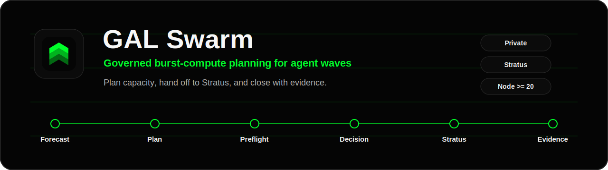
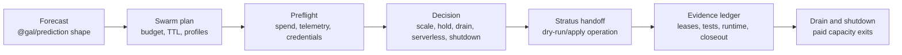

<p align="center">
  
</p>

<h1 align="center">GAL Swarm</h1>

<p align="center">
  <strong>Governed burst-compute planning for GAL agent waves.</strong>
</p>

<p align="center">
  <a href="https://github.com/gal-run/gal-swarm/actions/workflows/ci.yml"></a>
  <a href="package.json"></a>
  <a href="package.json"></a>
  <a href="package.json"></a>
  <a href="package.json"></a>
</p>

<p align="center">
  <a href="#quickstart">Quickstart</a> |
  <a href="#run-plan">Run Plan</a> |
  <a href="#architecture">Architecture</a> |
  <a href="#provider-model">Provider Model</a> |
  <a href="#docs">Docs</a> |
  <a href="#validation">Validation</a>
</p>

GAL Swarm answers one operational question: when forecasted agent work spikes,
should GAL scale capacity, hold, drain, route tail work to serverless, or shut
the burst down?

`gal-queue` owns durable steady dispatch. `@gal/swarm` owns the temporary
compute-control-plane contracts around burst planning, Stratus-facing run
plans, provider-neutral cost ranking, hot-start SLOs, and evidence closeout.

## At A Glance

<table>
  <tr>
    <td width="33%">
      <strong>Plan the burst</strong><br>
      Convert forecasted agent pressure into budgeted swarm plans, TTLs,
      capacity policy, and startup gates.
    </td>
    <td width="33%">
      <strong>Hand off safely</strong><br>
      Emit Stratus-facing dry-run or apply operations without direct provider
      calls from the package.
    </td>
    <td width="33%">
      <strong>Close with evidence</strong><br>
      Track leases, tests, runtime records, conflicts, reconciliation, and
      closeout criteria for governed waves.
    </td>
  </tr>
</table>

| What you need | Use GAL Swarm for |
| --- | --- |
| A short-lived agent compute spike | Plan capacity, TTL, budget, drain, and shutdown. |
| A safe Stratus handoff | Generate dry-run or apply-ready provider operations without direct provider calls. |
| A governed 300-lane coding wave | Track worker evidence, leases, conflicts, reconciliation, and closeout. |
| Provider choice before spend | Rank candidates by cost, availability, latency, reliability, locality, and reservations. |
| Millisecond startup claims | Separate hot dispatch to pre-warmed runners from cold provisioning. |

| Boundary | Owner |
| --- | --- |
| Durable queue semantics | `gal-queue` |
| Burst contracts and capacity decisions | `@gal/swarm` |
| Concrete GPU provisioning | Stratus provider adapters |
| Artifact generation and verification gates | Prompt-to-Binary framework |
| Python swarm runtime execution | Out of scope |

## Quickstart

This package is private and is not published to the public npm registry.
Internal releases are packed artifacts; registry installs are valid only where a
GAL internal registry has been configured.

```sh
npm pack --pack-destination /tmp
npm install /tmp/gal-swarm-0.3.3.tgz
```

For local development:

```sh
npm ci
npm run type-check
npm test
npm run build
npm run smoke:consumer
```

Additional proofs:

```sh
npm run proof:startup-latency
npm run proof:wave-300
```

## Architecture



The package is deliberately serializable. Its outputs can move through GAL API,
GAL Code, Stratus, GitHub Actions, or future worker runtimes without importing a
provider SDK or vendoring a Python swarm engine.

## Run Plan

Create a Stratus-facing dry-run plan:

```ts
import { createGalSwarmRunPlan } from '@gal/swarm'

const runPlan = createGalSwarmRunPlan({
  orgName: 'gal-run',
  objective: 'Dry-run a release verification burst.',
  source: 'gal-code',
  mode: 'dry-run',
  target: {
    sandboxProvider: 'stratus',
    computeProfileId: 'stratus-standard-burst',
    capacityPolicyProfile: 'dev-smoke',
    desiredWorkers: 8,
    desiredComputeUnits: 1,
    ttlHours: 1,
    maxHourlyUsd: 10,
    serverlessEndpointId: 'serverless-gal-code-fallback',
  },
  workload: {
    tasks: 12,
    promptTokens: 120_000,
    completionTokens: 30_000,
    toolCalls: 40,
    workflowWaitSeconds: 600,
    sandboxCount: 8,
  },
})

console.log(runPlan.status)
console.log(runPlan.stratusOperations.map((operation) => operation.type))
```

Expected output shape:

```text
planned
["preflight","burst-start-plan","burst-run","monitor","drain"]
```

For lower-level policy work, use `planGalSwarmDecision()` with a
`GalSwarmPlan`, `GalSwarmLoadSnapshot`, and `GalSwarmCostSnapshot`.

## Swarm Architecture Modes

GAL Swarm has two mode layers:

| Layer | Values | Purpose |
| --- | --- | --- |
| Run mode | `dry-run`, `apply` | Controls whether a plan can execute provider operations. `apply` requires explicit approval evidence. |
| Architecture mode | `router`, `sequential`, `concurrent`, `graph`, `hierarchical`, `mixture`, `group_chat`, `forest`, `heavy` | Controls how work is split into lanes, reviews, reconciliation, and evidence. |

The architecture mode is a governed topology, not an external orchestration
runtime. `router` is the normal entrypoint: GAL inspects task count,
dependencies, risk, evidence needs, and fleet availability, then selects a
concrete topology.

| Mode | Use it for | Shape |
| --- | --- | --- |
| `router` | Default user-facing entrypoint. | Chooses the concrete topology and records the routing reason. |
| `sequential` | One narrow, low-risk task chain. | Single lane with ordered execution. |
| `concurrent` | Independent work with no shared file ownership. | Parallel lanes under one plan. |
| `graph` | Work with explicit dependencies. | DAG ordering with dependency validation. |
| `hierarchical` | Multi-area delivery that needs direction. | Director, bounded workers, reviewer, reconciler, verifier. |
| `mixture` | Competing proposals or model answers. | Independent proposals with aggregator synthesis. |
| `group_chat` | Deliberation before execution. | Bounded discussion; not the default coding path. |
| `forest` | Broad multi-repository or specialist-team work. | Multiple teams under one evidence ledger. |
| `heavy` | High-risk, release, security, or policy-critical work. | Redundant review, verifier proof, and stronger closeout gates. |

Public Swarms architecture names are accepted as aliases and normalized before
routing. Client surfaces should read `listGalSwarmTopologyAliases()` instead of
copying hard-coded lists.

| Alias family | Examples | Canonical GAL mode |
| --- | --- | --- |
| Workflow | `SequentialWorkflow`, `ConcurrentWorkflow`, `GraphWorkflow` | `sequential`, `concurrent`, `graph` |
| Organization | `HierarchicalSwarm`, `PlannerWorkerSwarm`, `HHCS`, `PyramidSwarm` | `hierarchical` |
| Organization | `ForestSwarm`, `Tree`, `TreeAgent` | `forest` |
| Reordering | `AgentRearrange`, `SwarmRearrange`, `CircularSwarm`, `MeshSwarm`, `StarSwarm` | `graph` |
| Routing | `SwarmRouter`, `MultiAgentRouter`, `AgentRouter`, `ModelRouter`, `SkillOrchestra` | `router` |
| Proposal synthesis | `MixtureOfAgents`, `MoA`, `SelfMoASeq`, `MajorityVoting`, `LLMCouncil` | `mixture` |
| Deliberation | `GroupChat`, `InteractiveGroupChat`, `DebateWithJudge`, `RoundTableDiscussion` | `group_chat` |
| Heavy review | `HeavySwarm`, `AdvisorSwarm`, `PlannerGeneratorEvaluator`, `PeerReviewProcess`, `TrialSimulation` | `heavy` |
| Auto selection | `AutoSwarmBuilder`, `auto` | GAL auto routing, then a concrete mode |

## Decision Surface

| Action | Meaning |
| --- | --- |
| `scale_up` | Runnable pressure exceeds the threshold and projected spend fits the budget. |
| `hold` | Current capacity is justified by utilization or deadline pressure. |
| `drain` | Utilization is low; stop admitting new work and let active workers finish. |
| `route_serverless` | Tail work is cheaper or safer on a declared serverless endpoint. |
| `shutdown` | No runnable work remains and utilization is below shutdown policy. |

| API | Purpose |
| --- | --- |
| `createGalSwarmRunPlan()` | Create Stratus-facing preflight, burst, monitor, and drain operations. |
| `decideGalSwarmCapacity()` | Apply the run-plan capacity policy model. |
| `createGalSwarmProviderActionPlan()` | Convert capacity decisions into dry-run or apply provider operations. |
| `planGalSwarmDecision()` | Decide scale, hold, drain, serverless routing, or shutdown from plan/load/cost. |
| `evaluateGalSwarmBurstPreflight()` | Block unsafe startup before provider spend. |
| `selectGalSwarmProvider()` | Rank declared provider candidates without making provider calls. |
| `createGalSwarmTopologyPlan()` | Route governed work into director, worker, reviewer, reconciler, and verifier lanes. |
| `createGalSwarmWaveEvidenceLedger()` | Normalize wave evidence for governed collaboration. |
| `summarizeGalSwarmWaveEvidence()` | Check reconciliation and closeout readiness. |

## Provider Model

GAL Swarm separates model inference from sandbox execution.

| Axis | Production status |
| --- | --- |
| AI providers | `deepseek`, `claude`, `gemini`, `openai`, and `runpod` are enabled. Other names remain in the catalog for compatibility. |
| Sandbox providers | `stratus` is the only production-enabled sandbox provider. Other sandbox names are modeled but disabled direct targets. |
| GPU provisioning | Out of scope. Stratus maps contracts to concrete provider APIs, runners, Kubernetes/Kata, and shutdown behavior. |
| H200 policy | Avoid AWS, Azure, and GCP as default paid H200 providers until cost and quota posture changes. |

Preflight profiles such as `gcp-l4-spot-glm-4-9b-tool-call-smoke` describe cheap
startup smoke targets that Stratus can execute. They are startup evidence, not
direct production sandbox providers.

## Hot-Start SLO

Hot start means dispatch to already-warm capacity:

```text
milliseconds = queue admission to an already pre-warmed runner
```

It does not mean cold VM, pod, or runner creation. A 300-sandbox wave can claim
millisecond dispatch only when warm idle or warm allocatable capacity can absorb
all 300 sandboxes. Otherwise the correct path is cold provisioning.

## Evidence Closeout

`GalSwarmWaveEvidenceLedger` is the closeout contract for governed coding waves.
It records worker identity, repository assignments, file leases, proof artifacts,
test evidence, runtime evidence, conflicts, reconciler decisions, and closeout
criteria.

Closeout is blocked when worker evidence is missing, exclusive file leases
overlap, blocker conflicts remain open, criteria are unsatisfied, or high-risk
waves lack reconciler proof with passing test and runtime evidence.

## Docs

Repository docs start at [`docs/README.md`](docs/README.md). The package
artifact is intentionally lean; use the repository for the full docs tree.

| Document | Use |
| --- | --- |
| [`docs/api/gal-api-swarm-microservice.md`](docs/api/gal-api-swarm-microservice.md) | GAL API microservice ownership, package contract boundary, routes, modes, and tests. |
| [`docs/standard/architecture.md`](docs/standard/architecture.md) | Boundary, lifecycle, provider split, topology, and standard conformance. |
| [`docs/standard/requirements.md`](docs/standard/requirements.md) | Verifiable swarm requirements. |
| [`docs/standard/testing.md`](docs/standard/testing.md) | Always-on test surface, proof scope, evidence requirements, and non-claims. |
| [`docs/concepts/governed-coding-swarm.md`](docs/concepts/governed-coding-swarm.md) | 300-lane collaboration and evidence ledger model. |
| [`docs/operations/startup-latency-slo.md`](docs/operations/startup-latency-slo.md) | Hot-start SLO and proof command. |
| [`docs/operations/release-runbook.md`](docs/operations/release-runbook.md) | Internal package release gates. |
| [`docs/proofs/300-wave-dry-run-proof.md`](docs/proofs/300-wave-dry-run-proof.md) | 300-wave dry-run proof harness. |
| [`docs/releases/v0.3.3.md`](docs/releases/v0.3.3.md) | Current release notes and artifact hash. |

## Validation

CI runs type-check, tests, build, and consumer smoke through the Stratus runner
router in
[`.github/workflows/ci.yml`](.github/workflows/ci.yml).

```sh
npm run type-check
npm test
npm run build
npm run smoke:consumer
```

Local proof commands:

```sh
npm run proof:startup-latency
npm run proof:wave-300
```

## Support And Security

This is a private-first package. Keep provider credentials, runner tokens,
cluster identifiers, and customer data out of issues, logs, docs, and examples.

Use internal GitHub issues in this repository for package bugs and contract
changes. Route live infrastructure incidents outside this package to Stratus
operations, because GAL Swarm only emits planning contracts and dry-run/apply
operation descriptions.

## Release

Do not publish public packages until contract shape, security boundaries, and
provider-adapter policy are approved. Internal releases must pass type-check,
tests, build, consumer smoke, proof commands, secret review, and provider
boundary review before tagging.
